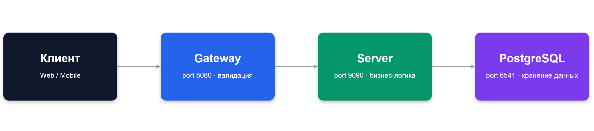

# 🤝 ShareIt - Микросервисное приложение для шеринга вещей.


Это backend-платформа, которая позволяет пользователям делиться своими вещами с соседями, друзьями и коллегами: от дрели, которая нужна на один вечер, до палатки для похода на выходные. Каждый может как предложить вещь в аренду, так и найти нужную ему вещь и забронировать её на определённые даты.

[](https://openjdk.org/)
[](https://spring.io/projects/spring-boot)
[](https://maven.apache.org/)
[](https://www.postgresql.org/)
[](https://www.docker.com/)
[](https://checkstyle.sourceforge.io/)
[](https://spotbugs.github.io/)
[](https://www.jacoco.org/jacoco/)
---

## ✨ Возможности

- 👤 **Пользователи** — регистрация, обновление профиля, управление аккаунтом
- 📦 **Вещи** — публикация вещей с описанием и статусом доступности, редактирование, полнотекстовый поиск
- 📅 **Бронирование** — запрос на аренду вещи с указанием периода, подтверждение или отклонение владельцем, история бронирований с фильтрацией по статусу (`ALL`, `CURRENT`, `PAST`, `FUTURE`, `WAITING`, `REJECTED`)
- 💬 **Комментарии** — отзыв о вещи может оставить только тот, кто её действительно арендовал
- 📝 **Запросы на вещь** — если нужной вещи нет в каталоге, можно оставить запрос, и другие пользователи предложат свой вариант

## 🏗 Архитектура

Проект построен по принципу **микросервисной архитектуры** и состоит из двух независимых Spring Boot приложений:



- **`gateway`** — принимает запросы, валидирует входные данные (Bean Validation) и проксирует их дальше на сервер. Отсекает некорректные запросы ещё на входе, не нагружая основной сервис.
- **`server`** — содержит основную бизнес-логику, работает с базой данных через Spring Data JPA.

Такое разделение позволяет масштабировать сервисы независимо и держать слой валидации отдельно от слоя данных.

## 🛠 Технологический стек

| Категория | Технологии |
|---|---|
| Язык / платформа | Java 21, Spring Boot 3.3 |
| Веб | Spring Web (REST) |
| Данные | Spring Data JPA, PostgreSQL, H2 (тесты) |
| Валидация | Jakarta Bean Validation, Hibernate Validator |
| Инфраструктура | Docker, Docker Compose |
| Качество кода | Checkstyle, JaCoCo (покрытие тестами) |
| Прочее | Lombok, Actuator |

___

## 📡 API

Все запросы к защищённым эндпоинтам требуют заголовок `X-Sharer-User-Id` — идентификатор текущего пользователя.

<details>
<summary><b>Users</b></summary>

| Метод | Эндпоинт | Описание |
|---|---|---|
| `POST` | `/users` | Создать пользователя |
| `GET` | `/users/{id}` | Получить пользователя |
| `GET` | `/users` | Получить всех пользователей |
| `PATCH` | `/users/{id}` | Обновить пользователя |
| `DELETE` | `/users/{id}` | Удалить пользователя |

</details>

<details>
<summary><b>Items</b></summary>

| Метод | Эндпоинт | Описание |
|---|---|---|
| `POST` | `/items` | Добавить вещь |
| `PATCH` | `/items/{id}` | Обновить вещь |
| `GET` | `/items/{id}` | Получить вещь по id |
| `GET` | `/items` | Получить все вещи владельца |
| `GET` | `/items/search?text=...` | Поиск вещей по названию/описанию |
| `POST` | `/items/{id}/comment` | Оставить комментарий к вещи |

</details>

<details>
<summary><b>Bookings</b></summary>

| Метод | Эндпоинт | Описание |
|---|---|---|
| `POST` | `/bookings` | Забронировать вещь |
| `PATCH` | `/bookings/{id}?approved={bool}` | Подтвердить/отклонить бронирование (владелец) |
| `GET` | `/bookings/{id}` | Получить бронирование по id |
| `GET` | `/bookings?state=...` | Бронирования текущего пользователя |
| `GET` | `/bookings/owner?state=...` | Бронирования вещей текущего владельца |

</details>

<details>
<summary><b>Item Requests</b></summary>

| Метод | Эндпоинт | Описание |
|---|---|---|
| `POST` | `/requests` | Создать запрос на вещь |
| `GET` | `/requests` | Получить свои запросы |
| `GET` | `/requests/all` | Получить запросы других пользователей |
| `GET` | `/requests/{id}` | Получить запрос по id |


</details>

___

## ▶️ Запуск проекта

```bash
# Клонировать репозиторий
git clone https://github.com/ChumakovPaul/java-shareit.git
cd java-shareit

# Собрать модули
mvn clean package

# Поднять всё окружение одной командой
docker-compose up --build
```

После запуска:
- Gateway доступен на `http://localhost:8080`
- Server (внутренний) — на `http://localhost:9090`
- PostgreSQL — на `localhost:6541`


---

## 👤 Автор

**Павел Чумаков**
, Backend-разработчик на Java / Spring
GitHub: [@ChumakovPaul](https://github.com/ChumakovPaul)
